# ECommerceApp
E-Commerce App - Radore Full-Stack Bootcamp

Geliştirilen kısımlar

1-Projenin orjinalinde .Web MVC tarafında Product'a tıklandığında sayfa açılmıyordu, hata veriyordu. 
+ _Layout.cshtml'de IsInRole vererek ve Radore.Web.Areas.Customer.Controllers içine CustomerProductController adında Controller yazarak hatayı önlemiş oldum şu an sorunsuz çalışıyor.
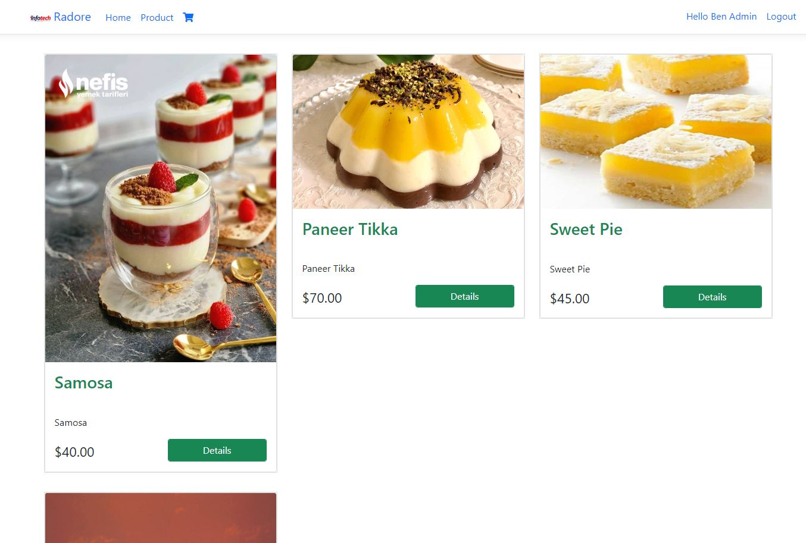
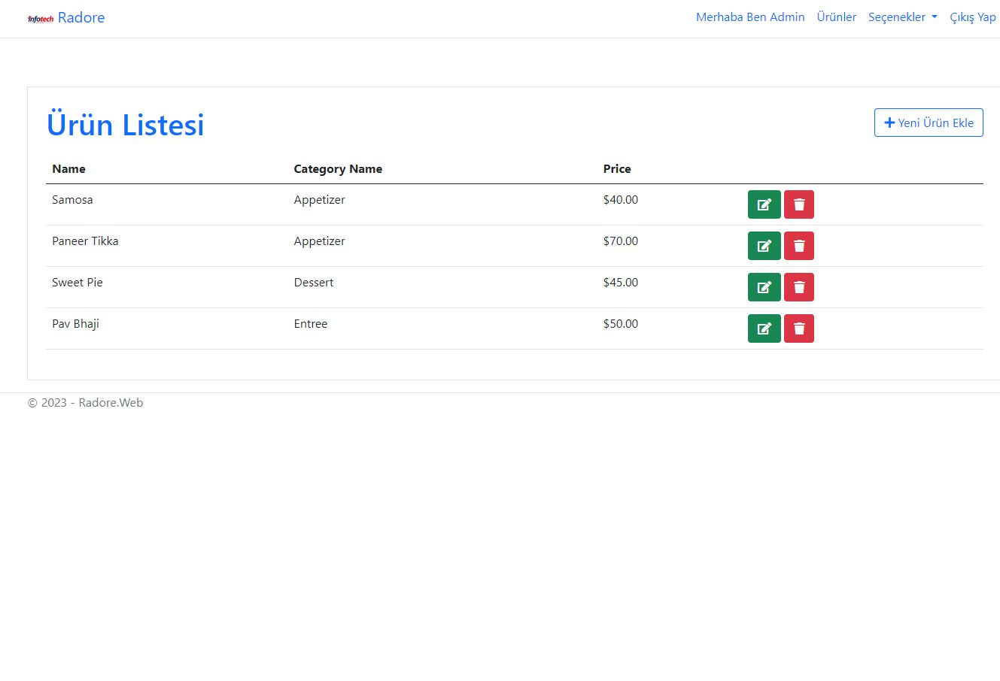

2-react.js tarafında login olurken bazı validasyon eksikleri vardı, yeni validasyonlar yazdım. Artık ibr@ibr.com adlı kullanıcın 'Password123!' ile giriş yapması gerek.
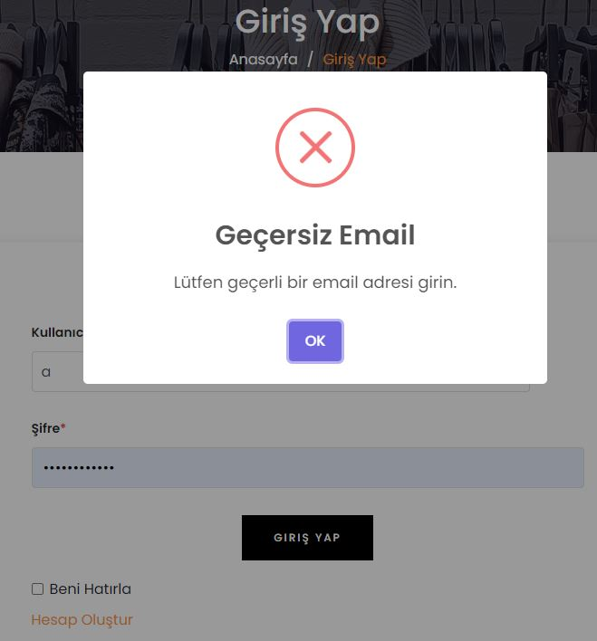
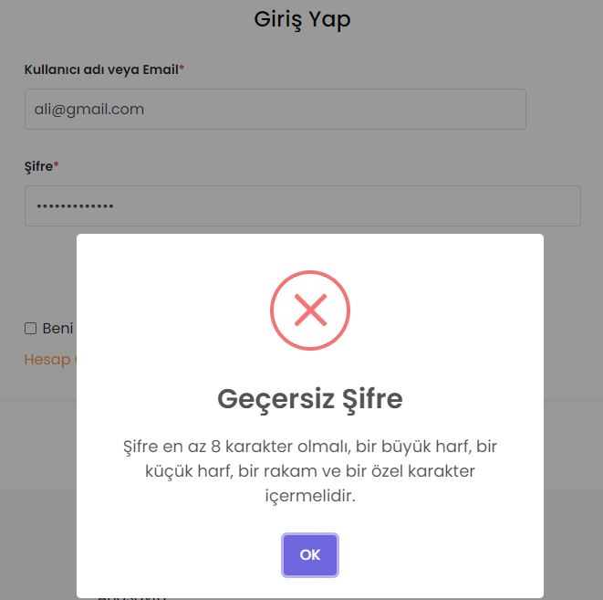

3-Radore.Services.ChatAPI adında yeni bir mikroservis yazdım daha sonra react.js tarafında bu servisi çektim ve bu sayede signalR ile anlık mesajlaşmayı sağlayan bir Canlı Destek hizmetim oldu.
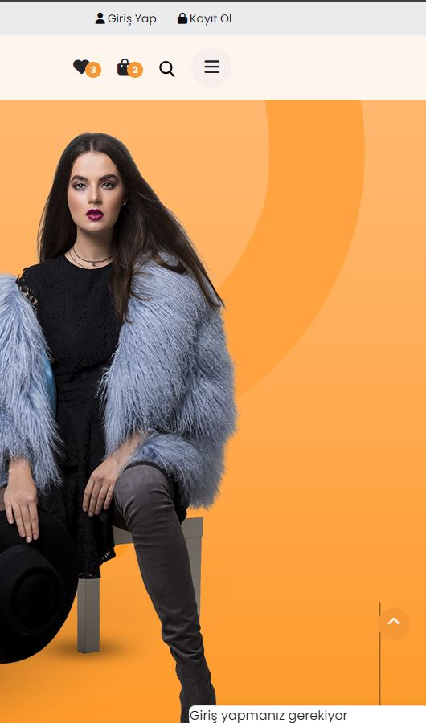
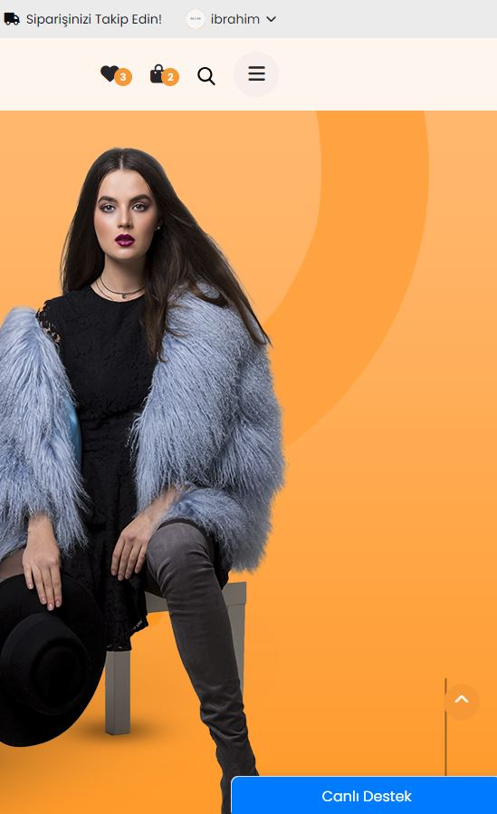
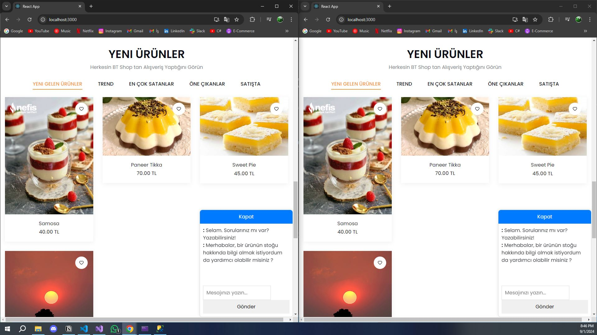

4-Mikroservis tarafında olan ürünleri çekerek react.js anasayfasının YENİ ÜRÜNLER adı altında ki 5'e ayrılmış ürün alanlarının hepsine giydirdim.
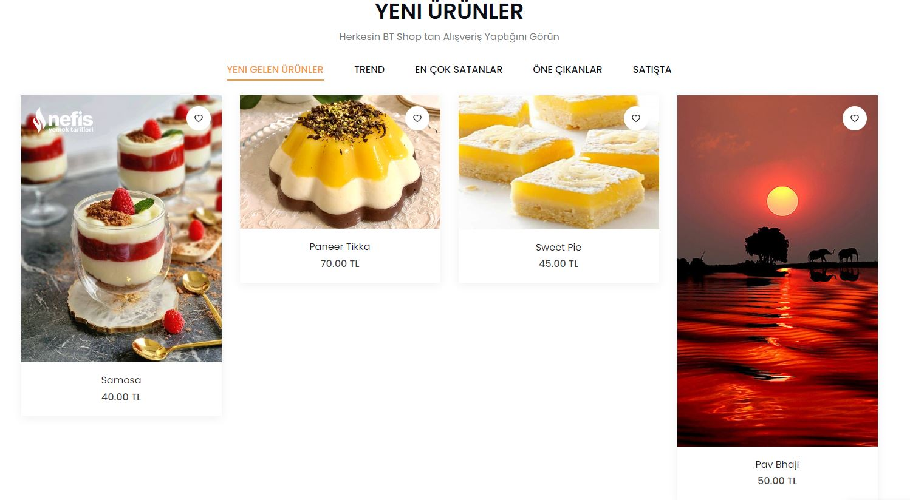
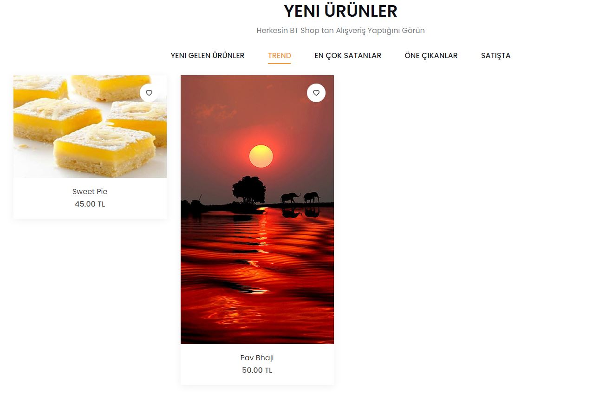
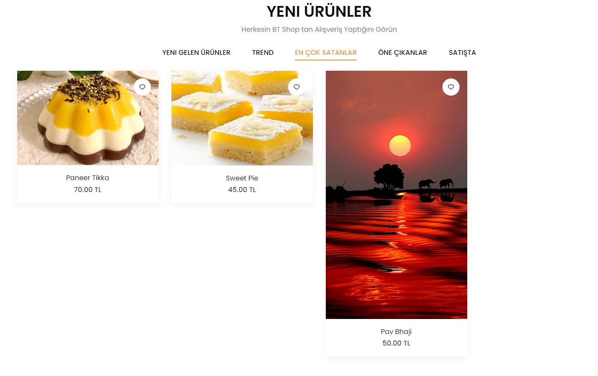
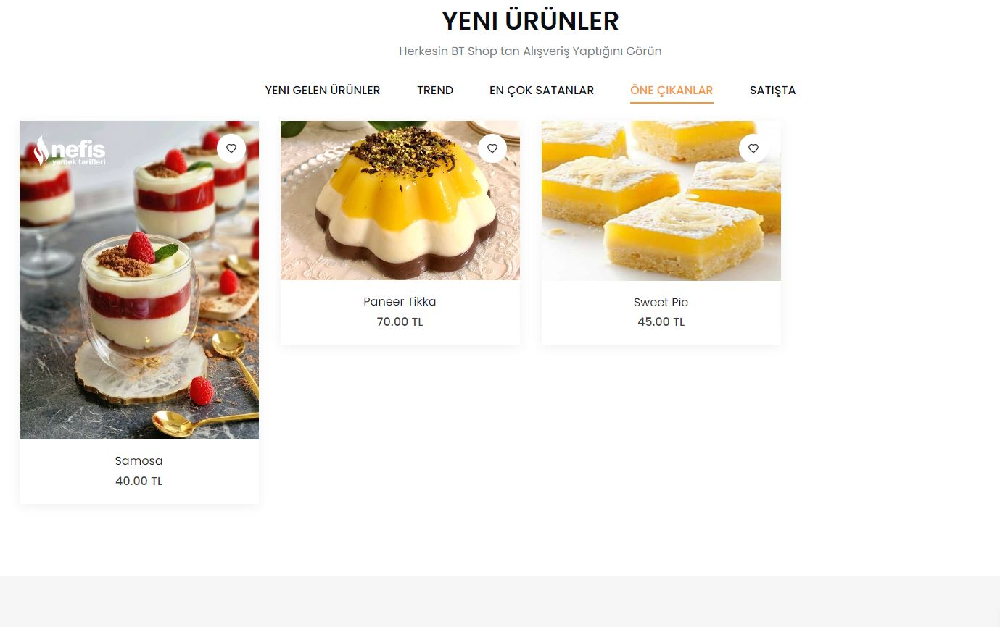
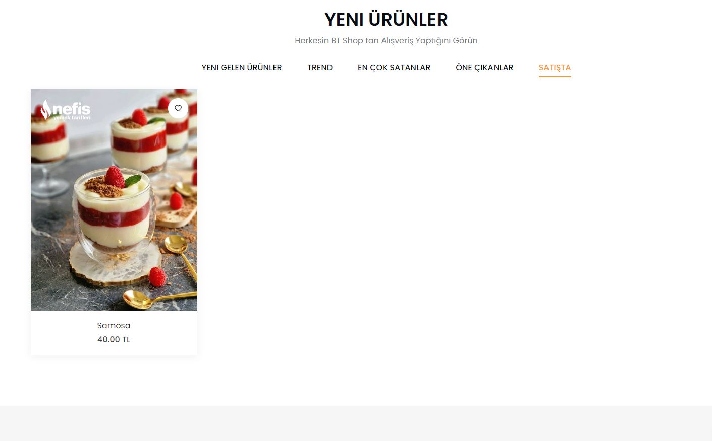

5-Aynı zamanda YENİ ÜRÜNLER'de ki tüm ürünlerin detay sayfaları da mikroservisten çekiyor. Detay sayfasındaki tüm ürünlerede detay ve açıklama gibi düzenlemeler yaptım.
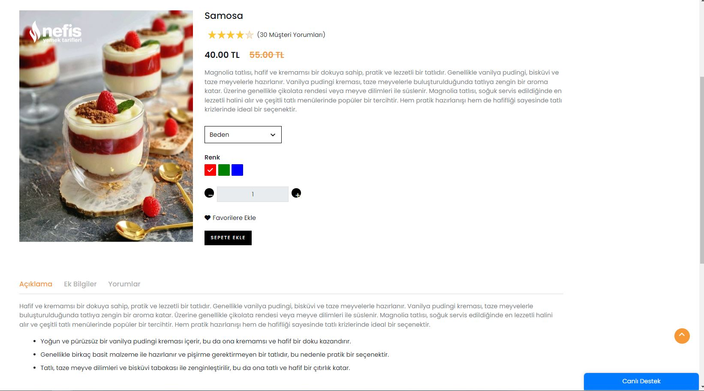
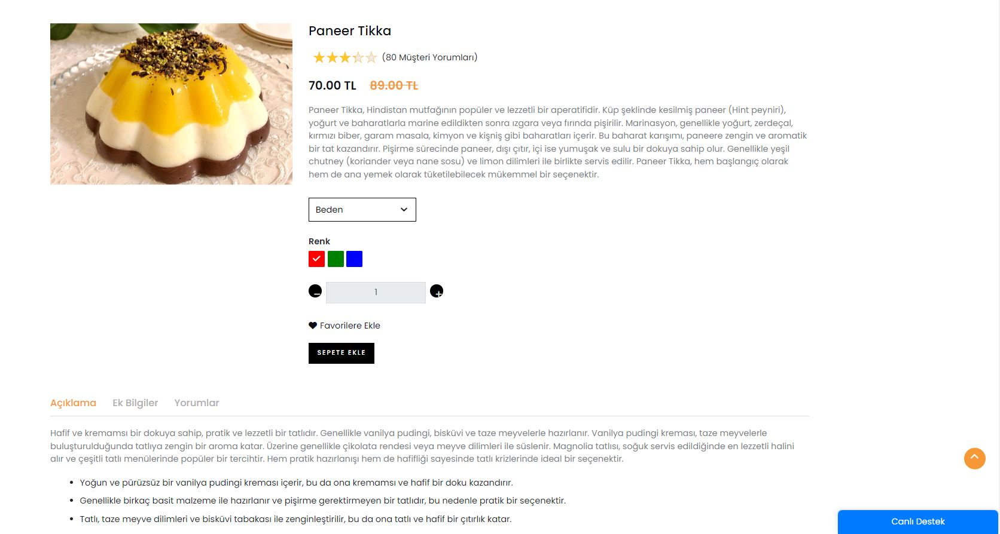
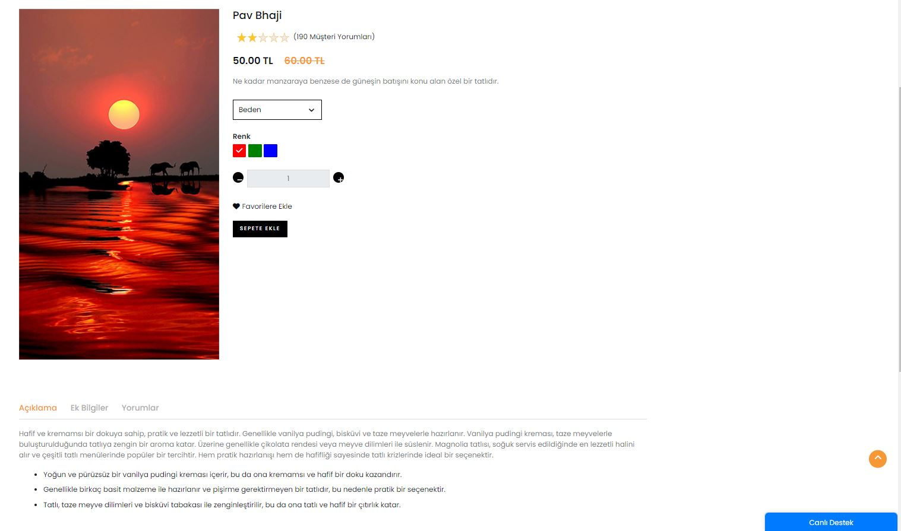
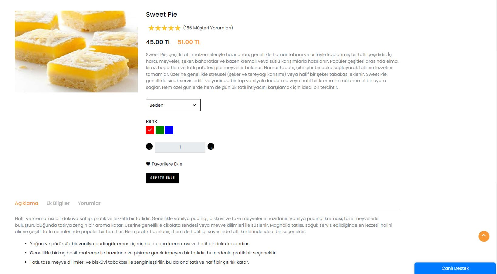

6-Unit test yazmaya çalıştım fakat bir yerde ufak bir hata aldım.